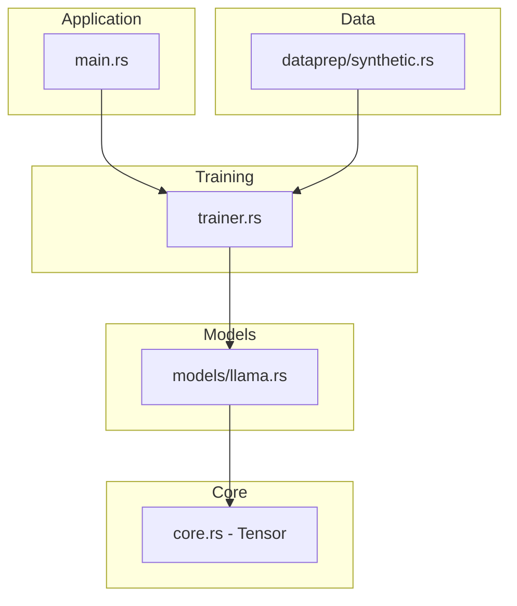
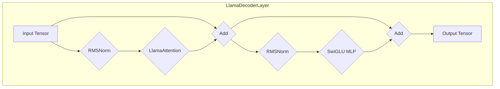
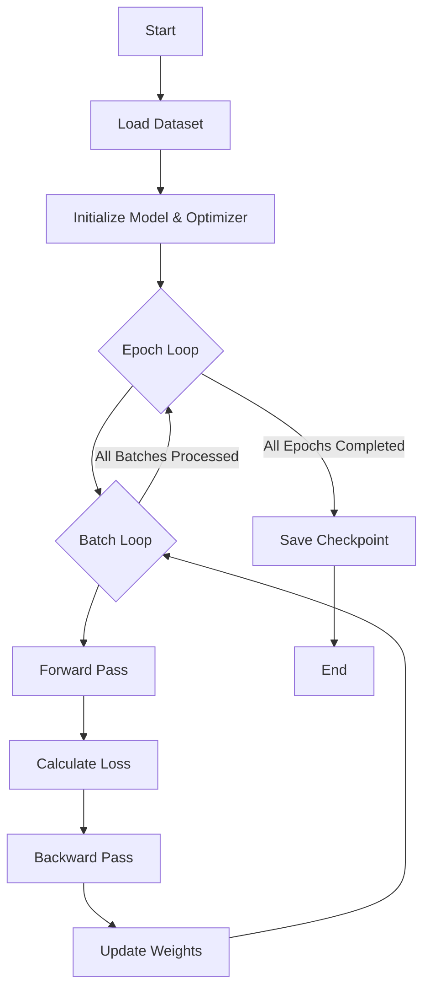

# Unsloth-rs

Unsloth-rs is a high-performance Rust framework for training and serving large language models, rewritten from the original Python project.

## Key Features

- **High Performance**: Built with Rust for maximum speed and efficiency.
- **Modern Architecture**: Leverages a modern transformer architecture with advanced features like RoPE and SwiGLU.
- **Dual Crate Structure**: Organized as both a library and a binary crate for flexible usage.
- **Extensible**: Designed to be easily extended with new models and features.

## Getting Started

### Prerequisites

- [Rust](https://www.rust-lang.org/tools/install) (latest stable version)
- [Git](https://git-scm.com/book/en/v2/Getting-Started-Installing-Git)

### Installation

1.  **Clone the repository**:
    ```bash
    git clone https://github.com/your-username/unsloth-rs.git
    cd unsloth-rs
    ```

2.  **Build the project**:
    ```bash
    cargo build
    ```

3.  **Run the tests**:
    ```bash
    cargo test -- --nocapture
    ```

## Folder Structure

```
unsloth-rs/
├── Cargo.toml
├── Cargo.lock
├── src/
│   ├── core.rs
│   ├── dataprep/
│   │   ├── mod.rs
│   │   └── synthetic.rs
│   ├── kernels/
│   │   └── mod.rs
│   ├── models/
│   │   └── llama.rs
│   ├── rl/
│   │   └── mod.rs
│   ├── utils/
│   │   └── mod.rs
│   ├── lib.rs
│   ├── main.rs
│   ├── save.rs
│   └── trainer.rs
└── tests/
    ├── core.rs
    ├── dataprep.rs
    ├── kernels.rs
    ├── mod.rs
    ├── models.rs
    └── trainer.rs
```

## Project Architecture

The project is organized into several modules, each with a specific responsibility. The diagram below illustrates the high-level architecture and the interaction between the major modules.

- **`main.rs`**: The entry point for the binary application, responsible for parsing command-line arguments and orchestrating the overall workflow.
- **`trainer.rs`**: Manages the training loop, including optimization, data loading, and model checkpointing.
- **`models/llama.rs`**: Implements the Llama model, including the attention mechanism, decoder layers, and overall model architecture.
- **`core.rs`**: Provides the fundamental `Tensor` struct and associated operations, which are the building blocks of the project.
- **`dataprep/synthetic.rs`**: Handles the generation of synthetic data for training and testing purposes.



## Llama Model

The Llama model implementation is a core component of this project. The diagram below illustrates the data flow through a single `LlamaDecoderLayer`.

The `LlamaDecoderLayer` consists of two main sub-layers:

1.  **Multi-Head Attention**: The input tensor is first normalized using RMSNorm, then passed through a multi-head attention mechanism. The output of the attention layer is then added to the original input tensor.
2.  **Feed-Forward Network**: The output of the attention sub-layer is again normalized and then passed through a SwiGLU MLP. The output of the MLP is then added to the input of this sub-layer.



## Training Framework

The training framework is responsible for orchestrating the training process. The diagram below illustrates the conceptual training loop.

The training process follows these steps:

1.  **Load Dataset**: The training data is loaded and preprocessed.
2.  **Initialize Model & Optimizer**: The Llama model and the optimizer are initialized with their respective configurations.
3.  **Epoch Loop**: The training process iterates over the dataset for a specified number of epochs.
4.  **Batch Loop**: Within each epoch, the data is processed in batches.
5.  **Forward Pass**: The model processes the input batch to generate predictions.
6.  **Calculate Loss**: The loss function computes the difference between the model's predictions and the actual targets.
7.  **Backward Pass**: The gradients of the loss with respect to the model's parameters are computed.
8.  **Update Weights**: The optimizer updates the model's weights based on the computed gradients.
9.  **Save Checkpoint**: At the end of training, a checkpoint of the model's state is saved.



## Contributing

Contributions are welcome! Please feel free to submit a pull request or open an issue.

## License

This project is licensed under the MIT License.
